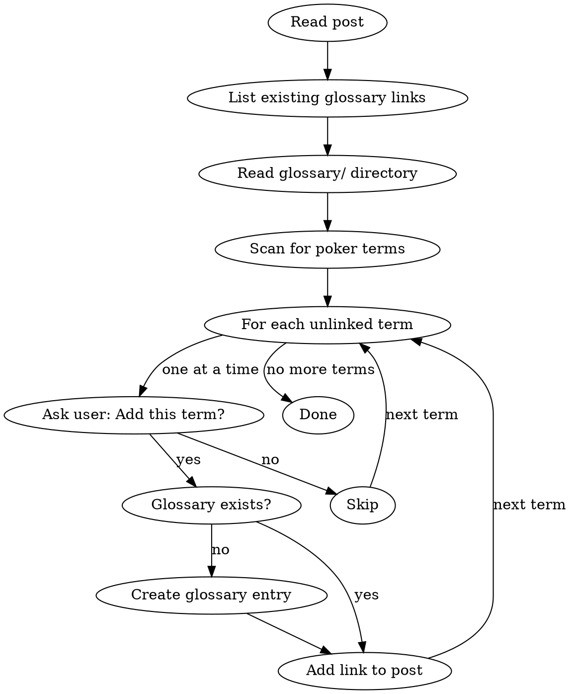

# Glossarize

Add interactive glossary links to poker blog posts, one term at a time with user confirmation.

## The System

**Glossary syntax:** `[display text](glossary:slug)`

**Term files:** `glossary/<slug>.md` with frontmatter `term: Display Name` and markdown body

**Canonical slugs:** All variants (plurals, tenses) link to one canonical slug:
- `[bankrolls](glossary:bankroll)` - plural links to singular
- `[tilting](glossary:tilt)` - gerund links to base form
- `[the nuts](glossary:nuts)` - display text differs from slug

## Workflow



## Step-by-Step

### 1. Gather Context

Read these files:
- The target post (markdown)
- All files in `glossary/` directory
- `notes/dev/glossary-system.md` if you need syntax reference

### 2. Identify Existing Links

Find all `[text](glossary:slug)` patterns in the post. Note:
- Which terms are already linked
- The canonical slug used for each
- **Check for broken links:** If a link references a slug that doesn't exist in `glossary/`, flag it for the user

### 3. Scan for Poker Terms

Look for poker-specific terms that would help beginners. Categories:
- **Hand types:** flush draw, set, trips, overpair, straight draw
- **Actions:** check-raise, semi-bluff, c-bet, three-bet
- **Concepts:** pot odds, equity, outs, implied odds, variance
- **Position:** UTG, button, cutoff, blinds
- **Player types:** calling station, TAG, LAG

### 4. Process Terms One-by-One

For EACH potential term, use AskUserQuestion:

```
Term: "flush draw" (appears 3 times, lines 81, 450, 607)
Glossary entry: Does not exist

Options:
- Yes, add to glossary and link
- Yes, link only (entry exists)
- Skip this term
```

**Critical:** Do NOT batch terms. Ask about each individually.

### 5. Create Glossary Entry (if needed)

When user approves a term without existing entry:

```markdown
---
term: Flush Draw
---

[2-3 sentence definition for beginners]

[Optional: bullet points, examples, or clarifications]
```

Keep entries concise. Match the style of existing entries (see `glossary/tilt.md` for reference).

### 6. Add Link to Post

Link the FIRST meaningful occurrence. Rules:
- Skip terms in headings
- Skip terms in code blocks
- Prefer the first occurrence in body text
- Use the canonical slug even when display text varies:
  - `sets` → `[sets](glossary:set)`
  - `flush draws` → `[flush draws](glossary:flush-draw)`

### 7. Report Summary

After processing all terms, show:
- Terms added with links
- New glossary entries created
- Terms skipped by user

## Plural/Tense Handling

Always link to the canonical (base) form:

| Display Text | Canonical Slug |
|--------------|----------------|
| bankrolls | bankroll |
| tilting, tilted | tilt |
| sets | set |
| bluffs, bluffing | bluff |
| flush draws | flush-draw |

The display text in the link preserves what's written in the post.

## Common Mistakes

**Batching decisions:** Don't show user a list and ask "which of these?" Process ONE term, get answer, move to next.

**Creating duplicate glossary entries:** Check existing entries before creating. `flush-draw.md` already exists? Just add the link.

**Linking every occurrence:** Only link the first meaningful occurrence per term. Over-linking annoys readers.

**Wrong canonical slug:** `[tilting](glossary:tilting)` is wrong. Use `[tilting](glossary:tilt)`.

**Skipping user confirmation:** Never add terms without asking. The user knows their audience and may have reasons to skip certain terms.
