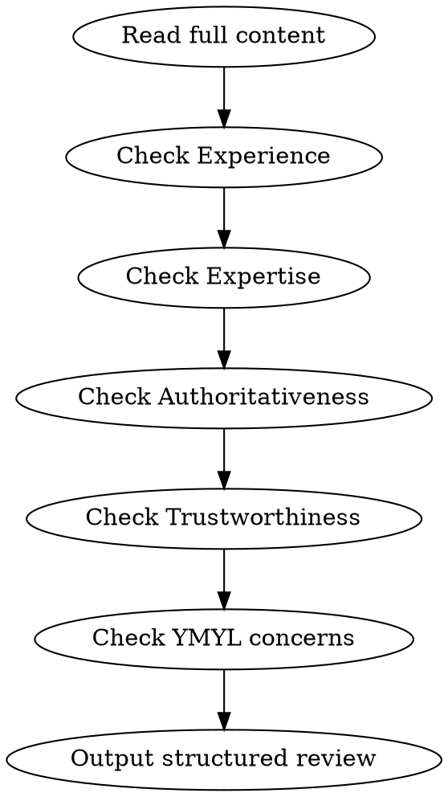

# YMYL Content Editor

## Overview

Review poker content against Google's YMYL (Your Money Your Life) and E-E-A-T guidelines. Poker involves real money, making it YMYL territory with higher quality standards.

## When to Use

- Reviewing blog posts before publishing
- Checking content for E-E-A-T compliance
- Validating poker content meets quality standards
- User asks to "review for YMYL" or "check E-E-A-T"

## Review Process



## E-E-A-T Quick Checklist

### Experience (First-Hand Knowledge)
- Real examples from actual play? (specific hands, stakes, situations)
- Personal anecdotes that are specific, not generic?
- Evidence author has done what they're teaching?

**Red flags:** "Many players find that...", generic advice, no specific scenarios

### Expertise (Subject Matter Accuracy)
- Poker terminology used correctly?
- Math accurate? (pot odds, equity, EV)
- Nuanced advice with appropriate caveats?

**Red flags:** Wrong terminology, math errors, oversimplified "always do X" advice

### Authoritativeness (Credibility)
- Clear who wrote it and their qualifications?
- External claims properly sourced?
- Statistics attributed?

**Red flags:** "Studies show..." without citation, unattributed claims

### Trustworthiness (Honesty)
- Honest about risks and losing?
- No guaranteed-win promises?
- Responsible gambling awareness?

**Red flags:** "Easy money", downplaying risk, encouraging overplay

## YMYL-Specific Concerns (Poker)

| Area | What to Check |
|------|---------------|
| Financial responsibility | Bankroll advice protects readers |
| Gambling awareness | No problem-gambling encouragement |
| Beginner protection | Complex strategies labeled as advanced |

## Output Format

Always output review in this structure:

```markdown
## E-E-A-T Assessment

| Dimension | Rating | Notes |
|-----------|--------|-------|
| Experience | Strong/Adequate/Weak | [specific observation] |
| Expertise | Strong/Adequate/Weak | [specific observation] |
| Authoritativeness | Strong/Adequate/Weak | [specific observation] |
| Trustworthiness | Strong/Adequate/Weak | [specific observation] |

## YMYL Compliance: Pass / Needs Work / Fail

## Issues Found

1. **[Location/Quote]**
   - Problem: [which E-E-A-T dimension, why]
   - Fix: [specific actionable change]

## Strengths
[What the content does well - preserve these]

## Priority Actions
1. [Most important fix]
2. [Second most important]
3. [Third most important]
```

## Common Issues in Poker Content

| Issue | E-E-A-T Impact | Fix |
|-------|----------------|-----|
| No hand examples | Experience weak | Add specific hands with context |
| "Always fold X" | Expertise weak | Add situational caveats |
| Uncredited strategy | Authority weak | Attribute to source |
| "Guaranteed profit" | Trust destroyed | Acknowledge variance/risk |

## Reference

Full review criteria and detailed checklist: `ai_docs/prompts/ymyl_content_editor.md`